&nbsp;&nbsp;&nbsp;&nbsp;&nbsp;&nbsp;&nbsp;&nbsp;

---

## 🧑‍💻 About Me

- 🎓 Computer Science undergrad at **Chennai Institute of Technology** (2024 – 2028)
- 🌀 **Terminally curious, mildly distracted** — AI/ML, cybersecurity, DevOps, systems, embedded tech... if it looks interesting, I'm probably trying to figure out how it works.
- 💼 R&D Intern @ **Dynamixon Technologies** — worked with embedded systems and UAV technology
- 🔬 Research Intern @ **Chennai Institute of Technology** — authored a review paper on Blockchain-Based Federated Learning
- 🛡️ Cybersecurity Intern @ **LaunchED** — network traffic analysis, vulnerability exploitation, malware analysis, and firewall configuration

---

## 🛠️ Tech Stack

<table>
  <tr>
    <td align="center" width="96">
      
       Python
    </td>
    <td align="center" width="96">
      
       C / C++
    </td>
    <td align="center" width="96">
      
       Java
    </td>
    <td align="center" width="96">
      
       Git
    </td>
    <td align="center" width="96">
      
       Docker
    </td>
    <td align="center" width="96">
      
       Linux
    </td>
    <td align="center" width="96">
      
       REST API
    </td>
  </tr>
  <tr>
    <td align="center" width="96">
      
       TypeScript
    </td>
    <td align="center" width="96">
      
       JavaScript
    </td>
    <td align="center" width="96">
      
       Solidity
    </td>
    <td align="center" width="96">
      
       React
    </td>
    <td align="center" width="96">
      
       Next.js
    </td>
    <td align="center" width="96">
      
       Node.js
    </td>
    <td align="center" width="96">
      
       Express
    </td>
  </tr>
  <tr>
    <td align="center" width="96">
      
       Tailwind
    </td>
    <td align="center" width="96">
      
       PostgreSQL
    </td>
    <td align="center" width="96">
      
       MongoDB
    </td>
    <td align="center" width="96">
      
       Redis
    </td>
    <td align="center" width="96">
      
       SQL
    </td>
  </tr>
</table>

 

---

## 🔨 Currently Building

<table>
<tr>
<td valign="top">

### ⚙️ CommitForge / Shipwright &nbsp; `private · in progress`
**Autonomous Developer Agent**

An AI-powered agent that automates the full software delivery loop — intelligent commit generation, branch management, code-aware task orchestration, and automated PR workflows. Built to reduce cognitive overhead in solo developer and small-team environments.

`Python` `LLMs` `Agentic AI` `Git Automation` `Developer Tooling`

</td>
</tr>
</table>

---

## 🚀 Featured Projects

<table>
<tr>
<td width="50%" valign="top">

### 🔗 [TerraLedger](https://github.com/daks19/TerraLedger)
**Hybrid Blockchain Land Registry**

Authoritative ownership records, escrow transfers, and inheritance flows on **Solidity smart contracts** (Polygon Amoy / Hardhat). Spatial boundaries in **PostGIS**; documents pinned to **IPFS**. Next.js + Express + Prisma + Redis, Dockerized.

`Solidity` `Next.js` `Node.js` `PostgreSQL/PostGIS` `IPFS` `Docker`

</td>
<td width="50%" valign="top">

### 📡 [ChiralNet](https://github.com/daks19/ChiralNet)
**Distributed Wi-Fi Signal Telemetry & Heatmap**

ESP32 nodes publish RSSI readings over **MQTT** to a Python/Node.js backend. A live Flask dashboard renders an RSSI heatmap over a configurable floor plan, auto-refreshing every 5 seconds.

`ESP32` `Embedded C` `MQTT` `Python` `SQLite`

</td>
</tr>
<tr>
<td width="50%" valign="top">

### 📊 [GovGraph](https://github.com/daks19/GovGraph)
**Open Government Data Analytics Platform**

Multi-sector visualization engine consuming **data.gov.in** REST APIs across Agriculture, Health, Education, and Budget. Vite + React frontend, serverless Express on **Vercel**, session-authenticated admin panel.

`TypeScript` `React` `Express` `Vercel Serverless`

</td>
<td width="50%" valign="top">

### 🛎️ [TraveRing](https://github.com/daks19/TraveRing)
**Proximity Alert & Geofencing Engine**

React Native + Expo app with continuous background geofencing. Users set a map waypoint and radius; a push notification fires on zone entry. Auto dark/light mode, runs on Expo Go without a native build.

`React Native` `Expo` `JavaScript` `Geolocation API`

</td>
</tr>
</table>

---

## 📄 Research

**A Taxonomical Survey of Blockchain-Based Federated Learning: Architectures, Privacy Mechanisms, and Applications**

> Systematic classification of BCFL architectures — on-chain model aggregation, differential privacy, and Byzantine-fault-tolerant consensus. Quantified ~60% improvement in adversarial attack resilience across reviewed frameworks.

*CIT Research Internship · 2025*

---

## 📊 GitHub Stats

  

 

  

---

## 💼 Experience

| Role | Organization | Focus |
|---|---|---|
| R&D Intern | Dynamixon Technologies | Embedded Systems & UAV Technology |
| Cybersecurity Intern | LaunchED | Network traffic analysis, vulnerability exploitation, firewall config |
| Research Intern | CIT Research | Blockchain-based Federated Learning Architectures |

---

## 🎓 Certifications

| Credential | Issuer |
|---|---|
| CCNA — Introduction to Networks | Cisco Networking Academy |
| Anthropic Certified | Anthropic |
| Google AI-ML for Developers | Google |
| Global Cybersecurity Certification | LaunchED |

